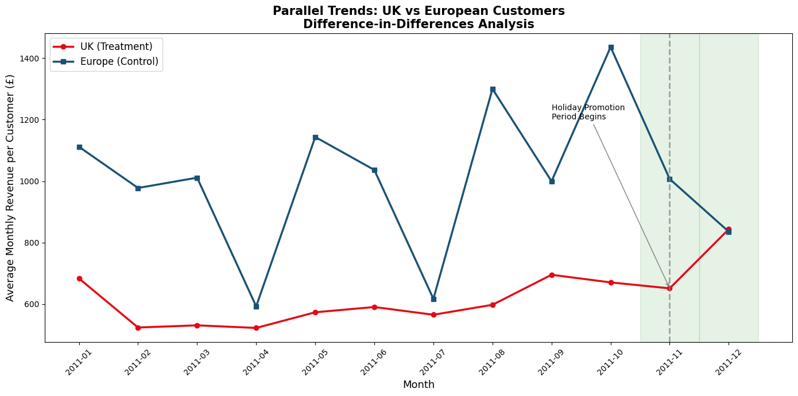
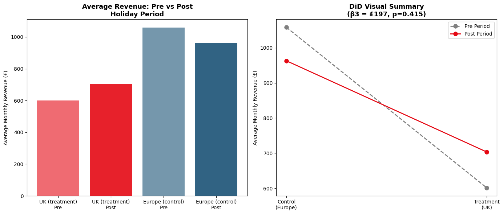

# Causal Inference: Measuring Promotion Impact on Customer Spending
### Difference-in-Differences Analysis on 500K+ Real Retail Transactions

## Business Problem
Did the 2011 holiday promotional period actually **cause** UK customers to spend more — or would spending have increased anyway due to seasonal trends? Correlation alone cannot answer this. Causal inference can.

## Methodology: Difference-in-Differences (DiD)
**Natural Experiment Design:**
- **Treatment Group:** UK customers (exposed to holiday promotions Nov-Dec 2011)
- **Control Group:** European customers — Germany, France, Netherlands, Belgium, Switzerland (no promotions)

**DiD Model:**

β3 = the causal estimate of promotion impact

## Results

### Parallel Trends Visualization

### DiD Results Summary

| Metric | Value |
|--------|-------|
| DiD Estimate (β3) | £197.41 per customer |
| P-value | 0.415 |
| 95% Confidence Interval | [-£277, +£672] |
| Statistical Significance | Not significant |

## Key Findings
The DiD estimate of £197 per customer is directionally positive but statistically non-significant (p=0.415). The wide confidence interval suggests high variance in individual spending behavior.

**Critical Insight:** The non-significant result reveals a methodological limitation — structural differences between UK and European customer bases may violate the parallel trends assumption. A more robust approach would use **propensity score matched customers** to create a cleaner counterfactual.

## Skills Demonstrated
- Causal inference (Difference-in-Differences)
- Natural experiment design
- OLS regression with interaction terms
- Parallel trends validation
- Segmentation analysis
- Python: pandas, statsmodels, matplotlib, seaborn
- Business insight communication

## Dataset
UCI Machine Learning Repository — Online Retail Dataset
500K+ transactions | 4,372 customers | 38 countries | Dec 2010 – Dec 2011

## Author
Basanthi Gorijala | Senior Data Scientist
[LinkedIn](https://www.linkedin.com/in/basanthi-gorijala)
